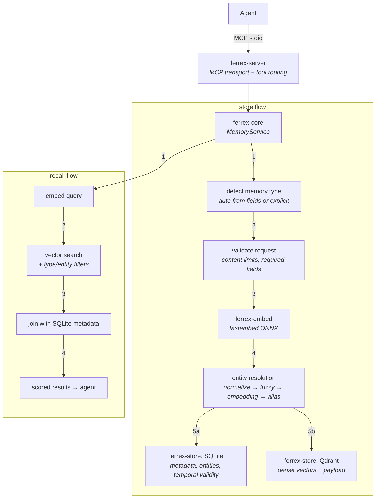

# ferrex

Local-first MCP memory server for AI agents. One Rust binary, a Qdrant sidecar, no cloud accounts.

Agents get five MCP tools -- `store`, `recall`, `forget`, `reflect`, `stats` -- for persistent memory across conversations. Memories are typed (episodic events, semantic facts, procedural workflows), entities get resolved even when agents name them inconsistently, and every fact carries temporal validity so stale data doesn't quietly rot your context.

Early development. Phase 1 (foundation) is implemented. [Roadmap](docs/design/roadmap.md) has what's coming next.

## How it works

When you store a memory, ferrex embeds the content locally (ONNX via fastembed), resolves any entity names against known aliases, then writes to both Qdrant (vector index) and SQLite (metadata). Recall embeds your query the same way, searches Qdrant with payload filters, and joins results back to SQLite for the full picture.

## Memory types

- **Episodic** -- events and observations. Timestamped, contextual. "User debugged a deadlock by switching to tokio::sync::Semaphore."
- **Semantic** -- stable facts as subject-predicate-object triples. "api-server uses tokio 1.38." Each fact carries `t_valid`/`t_invalid` timestamps so old versions don't disappear, they just stop being current.
- **Procedural** -- workflows and strategies. Versioned steps with activation conditions.

Type auto-detects from the fields you provide. Pass subject + predicate + object and it's semantic. Pass content and it's episodic. Or set the type yourself.

## Entity resolution

Agents name things inconsistently ("tokio" vs "Tokio" vs "tokio runtime"). ferrex resolves entities through a layered pipeline:

1. Normalize (lowercase, trim, collapse separators), check for exact match
2. Fuzzy string match (strsim, ratio > 0.85)
3. Embedding similarity (cosine > 0.92) for semantic equivalence
4. Ambiguous range (0.80--0.92) gets stored as alias candidates for later review

## Design docs

The design decisions are backed by research. 30+ papers and benchmarks informed the architecture -- agentic RAG surveys, hybrid retrieval studies, memory type taxonomies, cross-encoder reranking evaluations. The docs:

- [Main design doc](docs/design/ferrex-rag-memory.md) -- architecture, memory types, MCP tool API, retrieval pipeline
- [Design decisions](docs/design/design-decisions.md) -- 24 numbered decisions with rationale
- [References](docs/design/references.md) -- the papers, benchmarks, and prior art
- [Roadmap](docs/design/roadmap.md) -- phased implementation plan
- [Future improvements](docs/design/future-improvements.md) -- v2 features, deferred until there's measurement data to justify them

## License

MIT
