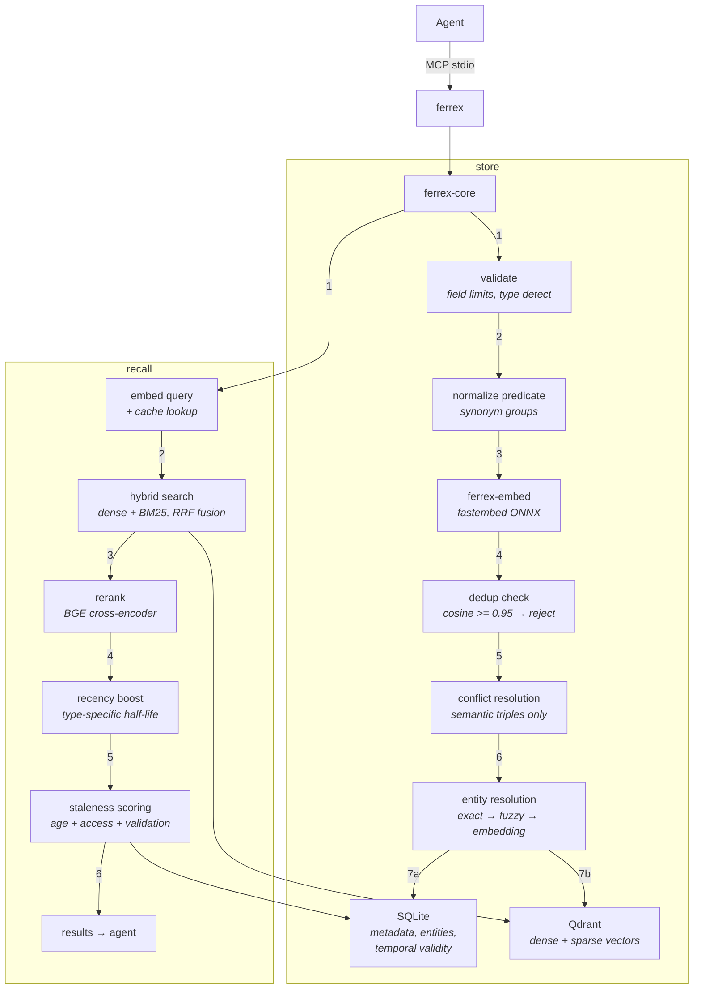

# ferrex

[](https://github.com/vaporif/ferrex/actions/workflows/ci.yml)

Local-first MCP memory server for AI agents. One Rust binary, a Qdrant sidecar, no cloud accounts.

Five MCP tools -- `store`, `recall`, `forget`, `reflect`, `stats` -- give agents persistent memory across conversations. Memories are typed (episodic events, semantic facts, procedural workflows), entities get resolved even when agents name them inconsistently, and facts carry temporal validity so stale stuff ages out instead of silently misleading.

## Architecture


```mermaid
flowchart TD
    Agent -->|MCP stdio| Server["ferrex"]
    Server --> Core["ferrex-core"]

    subgraph store_flow["store"]
        Core -->|1| Validate["validate\n<i>field limits, type detect</i>"]
        Validate -->|2| NormPred["normalize predicate\n<i>synonym groups</i>"]
        NormPred -->|3| Embed["ferrex-embed\n<i>fastembed ONNX</i>"]
        Embed -->|4| Dedup["dedup check\n<i>cosine >= 0.95 → reject</i>"]
        Dedup -->|5| Conflict["conflict resolution\n<i>semantic triples only</i>"]
        Conflict -->|6| Resolve["entity resolution\n<i>exact → fuzzy → embedding</i>"]
        Resolve -->|7a| SQLite["SQLite\n<i>metadata, entities,\ntemporal validity</i>"]
        Resolve -->|7b| Qdrant["Qdrant\n<i>dense + sparse vectors</i>"]
    end

    subgraph recall_flow["recall"]
        Core -->|1| EmbedQ["embed query\n<i>+ cache lookup</i>"]
        EmbedQ -->|2| Hybrid["hybrid search\n<i>dense + BM25, RRF fusion</i>"]
        Hybrid -->|3| Rerank["rerank\n<i>BGE cross-encoder</i>"]
        Rerank -->|4| Boost["recency boost\n<i>type-specific half-life</i>"]
        Boost -->|5| Stale["staleness scoring\n<i>age + access + validation</i>"]
        Stale -->|6| Return["results → agent"]
    end

    Hybrid --> Qdrant
    Stale --> SQLite
```

Four crates:

| Crate | What it does |
|-------|------|
| `ferrex-server` | Thin MCP shell. Deserializes tool calls, delegates to core, serializes responses. |
| `ferrex-core` | The pipeline. Validation, embedding, dedup, conflict resolution, entity resolution, staleness scoring, reranking. |
| `ferrex-embed` | Local ONNX inference via fastembed. Embedding and reranking models. |
| `ferrex-store` | Dual write to SQLite (metadata) and Qdrant (vectors). Transaction journal for crash recovery. |

## MCP tools

### `store`

Save a memory. Type auto-detects from fields (subject+predicate+object = semantic, content = episodic), or set it yourself.

Pipeline: validate → normalize predicate → embed → dedup check → conflict resolution → entity resolution → dual write → journal

| Parameter | |
|-----------|-------------|
| `content` | Free text (episodic/procedural) |
| `subject`, `predicate`, `object` | Triple (semantic) |
| `memory_type` | `episodic`, `semantic`, or `procedural` (auto-detected if omitted) |
| `confidence` | 0.0--1.0 (default 1.0) |
| `entities` | Entity names to link (resolved through the pipeline) |
| `namespace` | Isolation boundary (default "default") |
| `supersedes` | Memory ID to invalidate (bypasses dedup) |
| `source`, `context` | Optional metadata |

### `recall`

Semantic search with hybrid retrieval and reranking.

Pipeline: embed query → hybrid search (dense + BM25 sparse, RRF fusion) → rerank (BGE cross-encoder) → recency boost → staleness scoring → filter and return

| Parameter | |
|-----------|-------------|
| `query` | Natural language search |
| `types` | Filter by memory type |
| `entities` | Filter by linked entities |
| `namespace` | Scope the search |
| `limit` | Max results (default 10, max 200) |
| `time_range` | `{start, end}` in ISO-8601 |
| `include_stale` | Return stale memories too (default false) |
| `include_invalidated` | Return superseded memories too (default false) |
| `validate_ids` | Mark these IDs as validated (updates `last_validated`) |

### `forget`

Delete memories by ID from both stores.

| Parameter | |
|-----------|-------------|
| `ids` | Memory IDs to delete |

### `reflect`

Audit memory health. Finds stale memories and contradicting semantic facts.

| Parameter | |
|-----------|-------------|
| `namespace` | Scope |
| `limit` | Max items to scan (default 20) |
| `include_contradictions` | Find conflicting triples (default true) |
| `include_stale` | Find aging memories (default true) |

### `stats`

Memory system overview.

| Parameter | |
|-----------|-------------|
| `namespace` | Scope |
| `detailed` | Per-type counts, staleness distribution, entity count |

## Memory types

| Type | Structure | Example | Staleness half-life |
|------|-----------|---------|-------------------|
| Episodic | Free text | "User debugged a deadlock by switching to tokio::sync::Semaphore" | 30 days |
| Semantic | Subject-predicate-object triple | "api-server / uses / tokio 1.38" | 180 days |
| Procedural | Free text | Step-by-step deployment workflow | 365 days |

Semantic memories have `t_valid`/`t_invalid` timestamps. When a new fact supersedes an old one, the old memory gets invalidated rather than deleted, so you keep the history.

## How things work

### Entity resolution

Agents are bad at consistent naming ("tokio" vs "Tokio" vs "tokio runtime"). ferrex resolves entities in stages:

1. Normalize (lowercase, trim, collapse separators)
2. Exact match against the aliases table
3. Fuzzy match -- Jaro-Winkler > 0.85, matched name stored as alias
4. Embedding match -- cosine > 0.92, stored as alias
5. Nothing matched -- new entity created

### Predicate normalization

Free-form predicates get mapped to canonical groups. "uses", "depends-on", "requires", and "imports" all resolve to `depends_on`. Groups are configurable per namespace in `ferrex.toml`.

### Conflict resolution (semantic)

When you store a triple with the same subject and normalized predicate as something already in the system:

- Object similarity >= 0.95: duplicate, rejected
- Object similarity < 0.50: update, old memory invalidated
- 0.50--0.95: ambiguous, you need to pass `supersedes` explicitly

### Deduplication (episodic/procedural)

New memories get embedded and compared against existing ones in the same namespace. Cosine similarity >= 0.95 (configurable) triggers rejection.

### Staleness scoring

Recalled memories get a staleness score between 0.0 (fresh) and 1.0 (stale):

```
score = 0.40 * age_decay + 0.25 * access_decay + 0.25 * validation_decay + 0.10 * count_freshness
```

Decay is exponential with half-lives tuned per memory type. Results come back labeled fresh, aging, or stale based on configurable thresholds.

### Hybrid retrieval and reranking

Recall runs both dense (cosine) and sparse (BM25) searches in Qdrant, fuses them with reciprocal rank fusion, then reranks the top candidates using a BGE cross-encoder. Recency boosts are type-specific: episodic memories get a stronger recent-is-better signal than semantic ones, procedural gets none.

## Configuration

CLI flags, environment variables, or `~/.ferrex/ferrex.toml`.

| Flag | Env var | Default | |
|------|---------|---------|-------------|
| `--qdrant-url` | `FERREX_QDRANT_URL` | -- | Remote Qdrant endpoint (skip sidecar) |
| `--qdrant-bin` | `FERREX_QDRANT_BIN` | -- | Path to qdrant binary for sidecar |
| `--qdrant-port` | `FERREX_QDRANT_PORT` | 6334 | Sidecar gRPC port |
| `--model-tier` | `FERREX_MODEL_TIER` | best | `small` / `mid` / `best` |
| `--reranker-tier` | `FERREX_RERANKER_TIER` | default | `default` / `multilingual` |
| `--namespace` | `FERREX_NAMESPACE` | default | Default namespace |
| `--db-path` | `FERREX_DB_PATH` | ~/.ferrex/ferrex.db | SQLite path |
| `--config-path` | `FERREX_CONFIG_PATH` | ~/.ferrex/ferrex.toml | Config file |

### Embedding models

| Tier | Model | Dimensions |
|------|-------|-----------|
| small | all-MiniLM-L6-v2 | 384 |
| mid | bge-small-en-v1.5 | 384 |
| best | bge-base-en-v1.5 | 768 |

### TOML config

Thresholds, predicate synonym groups, staleness weights, cache sizes -- all configurable in `ferrex.toml`. See [`docs/design/ferrex-rag-memory.md`](docs/design/ferrex-rag-memory.md) for the full schema.

## CLI commands

```
ferrex                              # start MCP server (default)
ferrex audit reconcile [--fix]      # detect/fix Qdrant<>SQLite mismatches
ferrex backfill normalized-predicates [--dry-run]  # populate missing normalized predicates
```

## Design docs

- [Main design doc](docs/design/ferrex-rag-memory.md) -- architecture, memory types, MCP tool API, retrieval pipeline
- [Design decisions](docs/design/design-decisions.md) -- 24 numbered decisions with rationale
- [References](docs/design/references.md) -- papers, benchmarks, prior art
- [Roadmap](docs/design/roadmap.md) -- phased implementation plan
- [Future improvements](docs/design/future-improvements.md) -- v2 features, deferred until there's measurement data

## License

MIT
